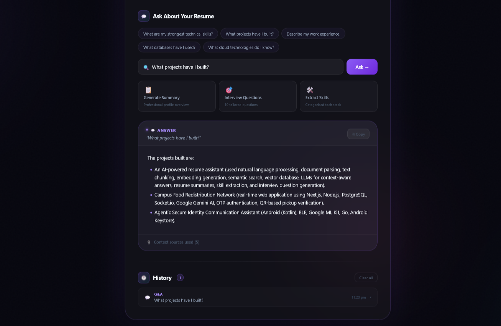
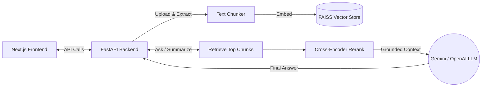

<div align="center">

# 📄 AI Resume Q&A Assistant

An intelligent, full-stack application for analyzing resumes using Retrieval-Augmented Generation (RAG). Upload a resume, ask natural-language questions, and generate summaries, skills breakdowns, or tailored interview questions from the indexed document!

[](https://nextjs.org/)
[](https://fastapi.tiangolo.com/)
[](https://www.python.org/)
[](https://deepmind.google/technologies/gemini/)

</div>

---

## 📸 Screenshots

<div align="center">
  
  <p><em>Figure 1: Resume Upload and Dashboard Interface</em></p>

  <br/>

  
  <p><em>Figure 2: Q&A Interaction and Skills Breakdown</em></p>
</div>

---

## ✨ Key Features

- **Multi-Format Uploads**: Supports `PDF`, `DOCX`, and `TXT` formats.
- **Plain-English Q&A**: Ask direct questions about the candidate's experience and background.
- **Smart Generation**:
  - 📝 Professional summary creation
  - 🛠️ Technical skills breakdown
  - 🎯 Tailored interview question generation
- **Advanced 2-Stage Retrieval**:
  - Fast vector search with `BAAI/bge-small-en-v1.5` embeddings.
  - Precise reranking using `cross-encoder/ms-marco-MiniLM-L-6-v2`.
- **Local Indexing**: Stores FAISS indexes locally with an automated cleanup workflow upon document deletion.

---

## 🏗️ Architecture



---

## 💻 Tech Stack

### Frontend
- **Framework**: Next.js 14, React 18, TypeScript
- **Styling**: TailwindCSS (or similar UI library)

### Backend
- **Core**: FastAPI, Uvicorn, Pydantic
- **Parsing**: `pdfplumber`, `python-docx`
- **Chunking**: `langchain-text-splitters`
- **Embeddings**: `sentence-transformers`
- **Vector Store**: `faiss-cpu`
- **LLM**: Google Gemini (`gemini-2.5-flash`), with optional fallback to OpenAI (`gpt-4o-mini`).

---

## 🚀 Getting Started

### Prerequisites

- Python 3.10+
- Node.js 18+
- npm

### 1. Clone the repository

```bash
git clone https://github.com/Sanju562586/AI-Resume-Q-A-Assistant.git
cd AI-Resume-Q-A-Assistant
```

### 2. Set up the Backend

Create and activate a virtual environment:

```bash
# macOS / Linux
python -m venv venv
source venv/bin/activate

# Windows PowerShell
.\venv\Scripts\Activate.ps1
```

Install backend dependencies:

```bash
pip install -r requirements.txt
```

Set up environment variables:

```bash
# macOS / Linux
cp .env.example .env

# Windows PowerShell
Copy-Item .env.example .env
```

Edit the `.env` file and set at least your **Gemini API Key**:

```env
GEMINI_API_KEY=your_gemini_api_key_here
# Optional
OPENAI_API_KEY=your_openai_api_key_here
```

Start the backend server:

```bash
python start_backend.py
# Or run uvicorn directly:
# uvicorn backend.main:app --reload --host 0.0.0.0 --port 8000
```
> **Note**: The first startup may take a few minutes as embedding and reranker models are downloaded and cached.

### 3. Set up the Frontend

Open a **new terminal** and navigate to the frontend directory:

```bash
cd frontend
npm install
```

*(Optional)* If your backend is running on a port other than `8000`, create a `.env.local` inside `frontend/`:
```env
NEXT_PUBLIC_API_URL=http://localhost:8000
```

Start the development server:

```bash
npm run dev
```

Your app will be running at [http://localhost:3000](http://localhost:3000).

---

## 📖 How to Use

1. Open [http://localhost:3000](http://localhost:3000) in your browser.
2. **Upload** a resume in PDF, DOCX, or TXT format (max 10MB).
3. **Ask** a question about the uploaded resume, or use the built-in actions to generate a summary, interview questions, or a skills list.
4. The system will retrieve relevant context, rerank it for precision, and use the LLM to generate a grounded, accurate response.

---

## ⚙️ Environment Variables Reference

### Backend (`/.env`)

| Variable | Required | Description |
|---|---|---|
| `GEMINI_API_KEY` | Yes* | Primary LLM key (*unless using OpenAI). |
| `OPENAI_API_KEY` | No | Optional fallback LLM key. |
| `ALLOWED_ORIGINS`| No | Comma-separated CORS origins (defaults to common Next.js/Localhost ports). |

### Frontend (`/frontend/.env.local`)

| Variable | Required | Description |
|---|---|---|
| `NEXT_PUBLIC_API_URL` | No | Backend base URL (defaults to `http://localhost:8000`). |

---

## 🔌 API Endpoints (FastAPI)

Once the backend is running, you can view the full interactive Swagger documentation at `http://localhost:8000/docs`.

| Method | Endpoint | Description |
|---|---|---|
| `GET` | `/health` | Service health check |
| `GET` | `/documents` | List indexed document IDs |
| `POST` | `/upload` | Upload and index a resume |
| `POST` | `/ask` | Ask a question about a resume |
| `POST` | `/summary` | Generate a professional summary |
| `POST` | `/interview-questions` | Generate interview questions |
| `POST` | `/skills` | Extract technical skills |
| `DELETE` | `/document/{document_id}` | Delete an indexed resume |

---

## 🛠️ Troubleshooting

- **No LLM API Key found**: Ensure your `.env` file exists in the root directory with either `GEMINI_API_KEY` or `OPENAI_API_KEY`.
- **Upload fails for Scanned PDF**: The parser requires text-based PDFs. Image-only/scanned resumes currently cannot be processed.
- **Frontend can't reach backend**: Verify the backend is running on port 8000, and `NEXT_PUBLIC_API_URL` is configured correctly if you changed ports.

---

<div align="center">
  <p>Built with ❤️ using Next.js and FastAPI.</p>
</div>
